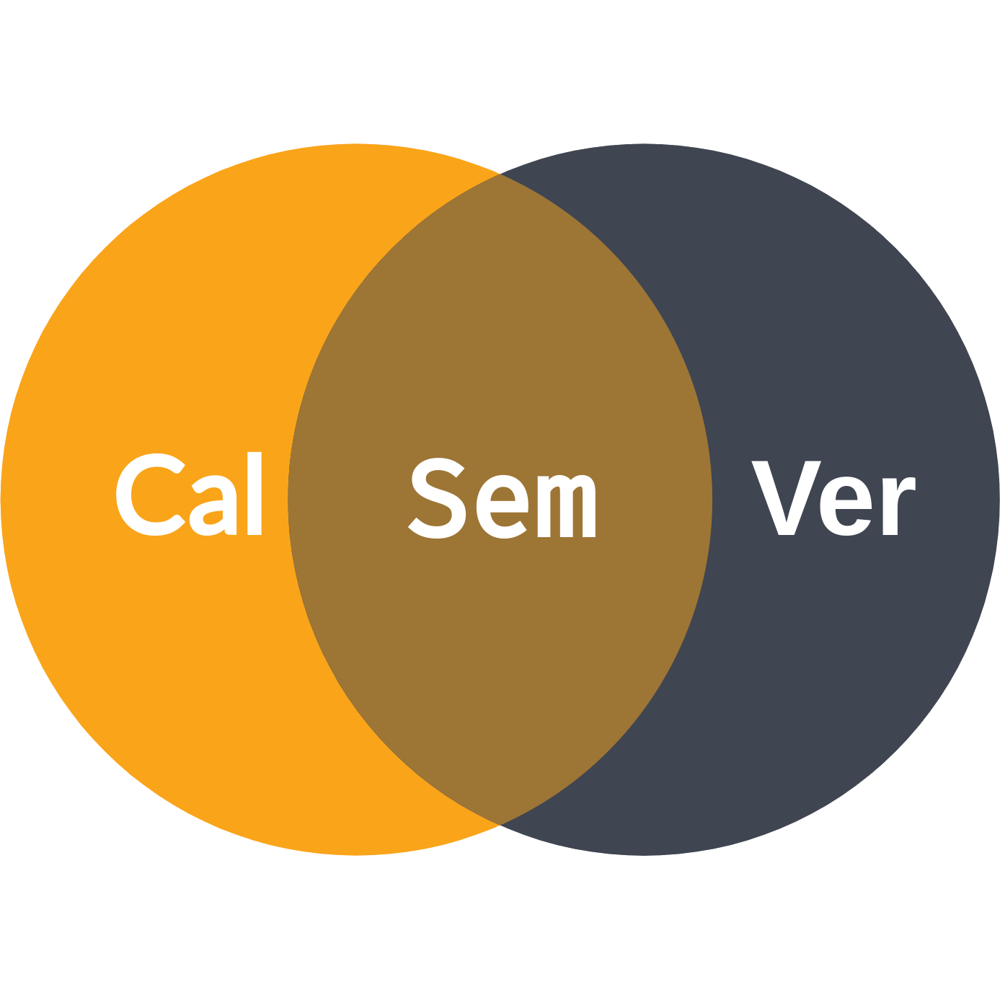

# CalSemVer

|        [**CalVer**][1] is ...         |   |       [**SemVer**][2]  is ...        |
|:-------------------------------------:|---|:------------------------------------:|
|        A versioning convention        |   |      A versioning specification      |
| That uses a date-based version number |   |    That defines rules for numbers    |
| To represent a project's code changes |   | To describe a project's code changes |

[**CalSemVer**][3] is a versioning convention that describes specific CalVer formats that are Semver compatible.

A major issue with any versioning scheme is not whether a newer version is available, but whether a newer version contains backward incompatible changes.

**SemVer** sought to fix this problem by introducing the concept that a major version number change indicates backward incompatible changes. This solution places the burden of determining compatibility on the developer of the software. As discussed in various places[^1], in practice, it is often not followed correctly (if at all).

**CalVer** does not try to solve this problem, placing the burden of determining compatibility on the consumer of the software. The main argument for this is that the consumer should be able to determine compatibility, as they should be familiar with the (vendor) code they are using.

**CalSemVer** is a combination of both approaches, using date-based versions that are SemVer compatible, with the advice to document backward breaking changes (and other changes) in release- or changelogs.[^2]

## Shortcomings

The major limitations of CalSemVer are similar to that of SemVer, in that it is up to the developer to make sure they actually follow the rules.

Without strict adherence to the rules, an update in the "major" version (to represent a new year) _might not_ contain any backward incompatible changes.

Conversely, a "minor" version update (to represent a new month) _might_ contain backward incompatible changes.

This limitation, [the steps needed to work around it][6], and whether developers are willing to follow these steps, are explicitly what dictate whether CalSemver is a good fit for a project or whether another versioning scheme should be used instead.[^3]

## Footnotes

[^1]: See: https://github.com/mahmoud/calver/issues/4, https://github.com/conventional-commits/conventionalcommits.org/issues/555, https://github.com/pypa/pipenv/issues/2191, etc.
[^2]: For instance adhering to [![Keep a Changelog convention][5]][4]
[^3]: Like CalVer, HashVer, IntVer, RandVer, or SemVer.

[1]: https://calver.org
[2]: https://semver.org
[3]: https://calsemver.org
[4]: https://keepachangelog.com/
[5]: https://img.shields.io/badge/Keep%20a%20Changelog-f15d30.svg?logo=data%3Aimage%2Fsvg%2Bxml%3Bbase64%2CPHN2ZyB4bWxucz0iaHR0cDovL3d3dy53My5vcmcvMjAwMC9zdmciIGZpbGw9IiNmZmYiIHZpZXdCb3g9IjAgMCAxODcgMTg1Ij48cGF0aCBkPSJNNjIgN2MtMTUgMy0yOCAxMC0zNyAyMmExMjIgMTIyIDAgMDAtMTggOTEgNzQgNzQgMCAwMDE2IDM4YzYgOSAxNCAxNSAyNCAxOGE4OSA4OSAwIDAwMjQgNCA0NSA0NSAwIDAwNiAwbDMtMSAxMy0xYTE1OCAxNTggMCAwMDU1LTE3IDYzIDYzIDAgMDAzNS01MiAzNCAzNCAwIDAwLTEtNWMtMy0xOC05LTMzLTE5LTQ3LTEyLTE3LTI0LTI4LTM4LTM3QTg1IDg1IDAgMDA2MiA3em0zMCA4YzIwIDQgMzggMTQgNTMgMzEgMTcgMTggMjYgMzcgMjkgNTh2MTJjLTMgMTctMTMgMzAtMjggMzhhMTU1IDE1NSAwIDAxLTUzIDE2bC0xMyAyaC0xYTUxIDUxIDAgMDEtMTItMWwtMTctMmMtMTMtNC0yMy0xMi0yOS0yNy01LTEyLTgtMjQtOC0zOWExMzMgMTMzIDAgMDE4LTUwYzUtMTMgMTEtMjYgMjYtMzMgMTQtNyAyOS05IDQ1LTV6TTQwIDQ1YTk0IDk0IDAgMDAtMTcgNTQgNzUgNzUgMCAwMDYgMzJjOCAxOSAyMiAzMSA0MiAzMiAyMSAyIDQxLTIgNjAtMTRhNjAgNjAgMCAwMDIxLTE5IDUzIDUzIDAgMDA5LTI5YzAtMTYtOC0zMy0yMy01MWE0NyA0NyAwIDAwLTUtNWMtMjMtMjAtNDUtMjYtNjctMTgtMTIgNC0yMCA5LTI2IDE4em0xMDggNzZhNTAgNTAgMCAwMS0yMSAyMmMtMTcgOS0zMiAxMy00OCAxMy0xMSAwLTIxLTMtMzAtOS01LTMtOS05LTEzLTE2YTgxIDgxIDAgMDEtNi0zMiA5NCA5NCAwIDAxOC0zNSA5MCA5MCAwIDAxNi0xMmwxLTJjNS05IDEzLTEzIDIzLTE2IDE2LTUgMzItMyA1MCA5IDEzIDggMjMgMjAgMzAgMzYgNyAxNSA3IDI5IDAgNDJ6bS00My03M2MtMTctOC0zMy02LTQ2IDUtMTAgOC0xNiAyMC0xOSAzN2E1NCA1NCAwIDAwNSAzNGM3IDE1IDIwIDIzIDM3IDIyIDIyLTEgMzgtOSA0OC0yNGE0MSA0MSAwIDAwOC0yNCA0MyA0MyAwIDAwLTEtMTJjLTYtMTgtMTYtMzEtMzItMzh6bS0yMyA5MWgtMWMtNyAwLTE0LTItMjEtN2EyNyAyNyAwIDAxLTEwLTEzIDU3IDU3IDAgMDEtNC0yMCA2MyA2MyAwIDAxNi0yNWM1LTEyIDEyLTE5IDI0LTIxIDktMyAxOC0yIDI3IDIgMTQgNiAyMyAxOCAyNyAzM3MtMiAzMS0xNiA0MGMtMTEgOC0yMSAxMS0zMiAxMXptMS0zNHYxNGgtOFY2OGg4djI4bDEwLTEwaDExbC0xNCAxNSAxNyAxOEg5NnoiLz48L3N2Zz4K
[6]: semver-compliance.md
